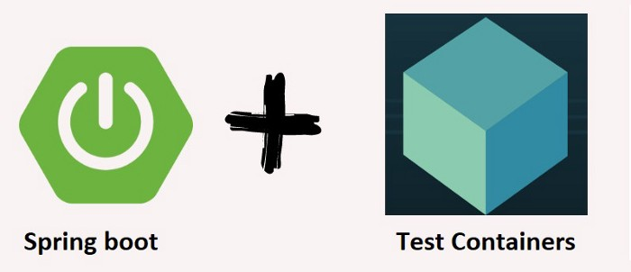

# spring-boot-testcontainers-db-it
This project represents spring boot with testcontainers which does the integration test and DAO test with preloaded data.

## Rest Controller
The class CustomerController.java contains the below endpoint.

**AVAILABLE ENDPOINTS**

| method            | resource          | description                                                                                   |
|:------------------|:------------------|:----------------------------------------------------------------------------------------------|
| `POST`		| `/api/customer`		| creates a customer record													|
| `GET`			| `/api/customer/{id}`		| get the customer information														|

## Prerequisite
-  Java
-  Docker Desktop

## Libraries used
-  Spring Boot
-  Spring Configuration
-  Junit
-  Development Tools

## Compilation Command
mvn clean install - Plain maven clean and install

## Reference
Please follow on my medium for detailed explainations

https://medium.com/@reachansari/database-integration-testing-with-testcontainers-8b4be2404a55